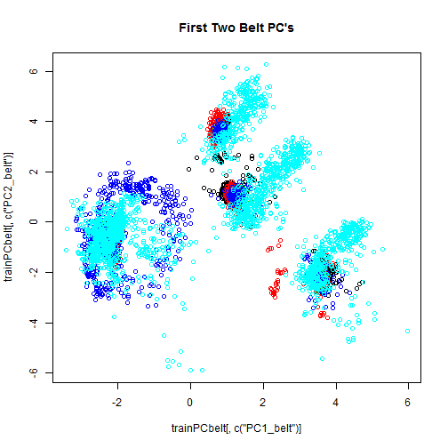
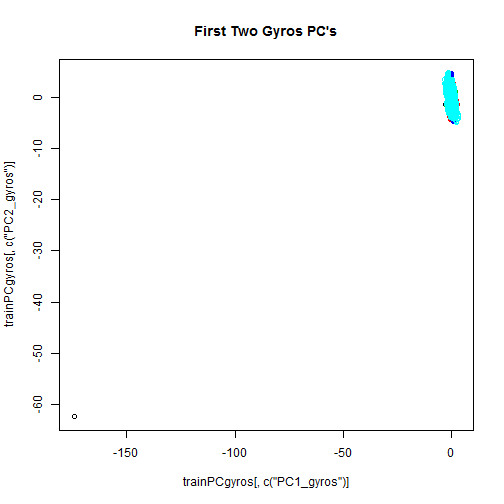
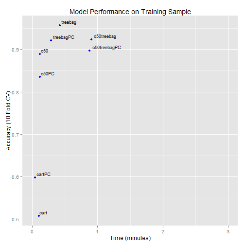

Data Mining Course Project - Predicting Activity Categories
========================================================
## Author: Christie Entwistle
## Date: 1/22/16

###Summary
The goal of this project is to predict weightlifting activity categories A through E, where each category corresponds to a particular manner in which the weightlifting is conducted (Class A: exactly according to specification, Class B: throwing elbows to the front, Class C: lifting dumbbell only halfway, Class D: lowering dumbbell only halfway, Class E: throwing hips to the front). The training set used for this exercise comes from http://groupware.les.inf.puc-rio.br/har and contains measured features coming from sensors placed on various parts of the body and the equipment used.

Several predictive models were considered. Accuracy of cross-validated results was used to decide between models, and accuracy on a hold-out set was used estimate the out of sample error of the final predictive model. Additionally, the run-time of the models was considered in choosing a model, as there is often a tradeoff between accuracy and computational speed (even though parallel processing was used for bagged models). In the end, a bagged CART model was chosen due to its relatively high accuracy and relatively quick computational speed.

###Data Preprocessing

Note: For brevity, the R code for preprocessing is not shown.

The training set and the test set for the project were read in. The training set dimensions (rows, columns) were (19622, 160) and the testing set dimensions were (20, 160). In order to properly assess the out of sample error, a training and test set within the training set were created with the caret package.


Examining our new training set, it appears that the variables are either fully populated with no NA values, or they are very sparsely populated with mostly NA values. Because of this pattern in the data, we can reduce the feature space by ignoring any features containing NA values. Then looking at the remaining variables with the summary function, we see some more columns that probably should be omitted (e.g. time stamp, window, etc). Of course the same preprocessing steps must be applied to the test set. 


Below are the remaining features and class variable that will be considered in the model (set "train"). 


```
##  [1] "user_name"            "roll_belt"            "pitch_belt"          
##  [4] "yaw_belt"             "total_accel_belt"     "gyros_belt_x"        
##  [7] "gyros_belt_y"         "gyros_belt_z"         "accel_belt_x"        
## [10] "accel_belt_y"         "accel_belt_z"         "magnet_belt_x"       
## [13] "magnet_belt_y"        "magnet_belt_z"        "roll_arm"            
## [16] "pitch_arm"            "yaw_arm"              "total_accel_arm"     
## [19] "gyros_arm_x"          "gyros_arm_y"          "gyros_arm_z"         
## [22] "accel_arm_x"          "accel_arm_y"          "accel_arm_z"         
## [25] "magnet_arm_x"         "magnet_arm_y"         "magnet_arm_z"        
## [28] "roll_dumbbell"        "pitch_dumbbell"       "yaw_dumbbell"        
## [31] "total_accel_dumbbell" "gyros_dumbbell_x"     "gyros_dumbbell_y"    
## [34] "gyros_dumbbell_z"     "accel_dumbbell_x"     "accel_dumbbell_y"    
## [37] "accel_dumbbell_z"     "magnet_dumbbell_x"    "magnet_dumbbell_y"   
## [40] "magnet_dumbbell_z"    "roll_forearm"         "pitch_forearm"       
## [43] "yaw_forearm"          "total_accel_forearm"  "gyros_forearm_x"     
## [46] "gyros_forearm_y"      "gyros_forearm_z"      "accel_forearm_x"     
## [49] "accel_forearm_y"      "accel_forearm_z"      "magnet_forearm_x"    
## [52] "magnet_forearm_y"     "magnet_forearm_z"     "classe"
```
There are still many features in the model, so it is of interest whether some of them are highly correlated. Below is a table showing highly correlated variables. 


```
##             Variable1        Variable2 Correlation
## 4    total_accel_belt        roll_belt   0.9810389
## 9        accel_belt_y        roll_belt   0.9246699
## 10       accel_belt_z        roll_belt  -0.9919234
## 60       accel_belt_x       pitch_belt  -0.9655142
## 63      magnet_belt_x       pitch_belt  -0.8873987
## 165      accel_belt_y total_accel_belt   0.9283603
## 166      accel_belt_z total_accel_belt  -0.9749737
## 375     magnet_belt_x     accel_belt_x   0.8939170
## 426      accel_belt_z     accel_belt_y  -0.9330038
## 903       gyros_arm_y      gyros_arm_x  -0.9192901
## 1593 gyros_dumbbell_z gyros_dumbbell_x  -0.9840917
## 1606  gyros_forearm_z gyros_dumbbell_x  -0.9343993
## 1710  gyros_forearm_z gyros_dumbbell_z   0.9482127
## 2334  gyros_forearm_z  gyros_forearm_y   0.8691207
```
It appears that measurements taken on the belt are highly correlated. Additionally measurements taken with a gyroscope tend to be correlated. Because of this pattern, PCA was run on two subsets of variables - those that contain "belt" measurements and those that contain "gyroscope" measurements. Since the PC's created for these two variables can be associated with those respective groups, we do not lose all interpretability. Running PCA at a 90% variance threshold separately on these subgroups, we look at plots of the two PC's for these groups to see how much separation they give:

  
It appears from the plot that there could be some good separation of the classe variable from the first and second PC's of the belt PC's, but it does not appear that the same goes for the gyros PC's. Therefore we will only include the PC's for the belt variable. We will replace the belt fields with their PC's and add back in all the other original fields.

Printed below are the names of the trainPC dataframe. The number of columns has been reduced from 54 to 45. Later we will see if this improves the modeling on the classe variable or not.


```
##  [1] "PC1_belt"             "PC2_belt"             "PC3_belt"            
##  [4] "PC4_belt"             "user_name"            "roll_arm"            
##  [7] "pitch_arm"            "yaw_arm"              "total_accel_arm"     
## [10] "gyros_arm_x"          "gyros_arm_y"          "gyros_arm_z"         
## [13] "accel_arm_x"          "accel_arm_y"          "accel_arm_z"         
## [16] "magnet_arm_x"         "magnet_arm_y"         "magnet_arm_z"        
## [19] "roll_dumbbell"        "pitch_dumbbell"       "yaw_dumbbell"        
## [22] "total_accel_dumbbell" "gyros_dumbbell_x"     "gyros_dumbbell_y"    
## [25] "gyros_dumbbell_z"     "accel_dumbbell_x"     "accel_dumbbell_y"    
## [28] "accel_dumbbell_z"     "magnet_dumbbell_x"    "magnet_dumbbell_y"   
## [31] "magnet_dumbbell_z"    "roll_forearm"         "pitch_forearm"       
## [34] "yaw_forearm"          "total_accel_forearm"  "gyros_forearm_x"     
## [37] "gyros_forearm_y"      "gyros_forearm_z"      "accel_forearm_x"     
## [40] "accel_forearm_y"      "accel_forearm_z"      "magnet_forearm_x"    
## [43] "magnet_forearm_y"     "magnet_forearm_z"     "classe"
```

 

Remember this is only assessed on a sample of 3000 observations in the training set. We will train the bagged CART on the entire training set with no PC's, with 10 fold cross validation. Our selection is based on the plot which shows us that the bagged CART has very high accuracy and also doesn't take too long (none of the models took an extremely long time to complete) for the training sample. One has to apply the prediction function to an independent test set in order to get true out of sample error value, so we will use our test set to do so.

The code for the final model is displayed below.


```r
start.time <- Sys.time()

modFit <- train(classe~ .,data=train,
                method="treebag", trControl=trainControl(method = "cv", number = 10))

end.time <- Sys.time()
time.taken <- difftime(end.time, start.time, units = "mins")
 

predMod<-predict(modFit, test)
cm<-confusionMatrix(predMod, test$classe)
```

The out of sample accuracy appears to be 0.989 as compared to  0.987, the 10 fold crossvalidated accuracy on whole training set. 


